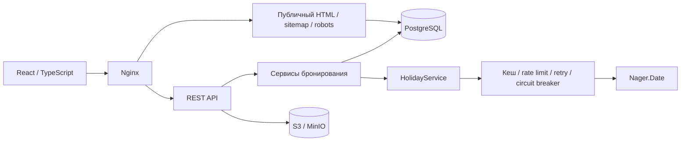

# Лабораторная работа №6 — контейнеризация и CI/CD

RoomFlow: бронирование переговорных комнат. Продолжение [исходного MVP](https://github.com/IWKMS99/RoomFlow) на согласованном стеке Java 24 / Spring Boot 3, React 19 / TypeScript, PostgreSQL и S3. История разработки сохранена.

## Контейнеризация

`Dockerfile` собирает frontend и backend отдельными стадиями; runtime содержит JRE и запускается от непривилегированного пользователя. `Dockerfile_nginx` содержит production frontend. Compose запускает PostgreSQL, закрытый MinIO, одноразовую инициализацию бакета, API и Nginx. База доступна только во внутренней сети, данные БД и объектов хранятся в именованных томах. Публикуемые локальные порты привязаны к `127.0.0.1`.

Порядок запуска задаётся health checks: БД и хранилище → создание закрытого бакета → приложение → Nginx. `restart: unless-stopped` обеспечивает перезапуск после аварийного завершения. `/healthz` проверяет приложение через reverse proxy. Настройки и секреты передаются переменными окружения; `.env` исключён из Git и Docker build context. Flyway выполняет миграции при запуске, ошибка миграции не допускает готовность приложения.

## CI/CD и бесплатный хостинг

GitHub Actions проверяет frontend, backend и статический анализ, затем собирает production Compose, выполняет запросы к настоящим PostgreSQL и S3 и собирает отдельный образ Render. `docker-compose.ci.yml` подменяет только сторонний календарь детерминированным HTTP-сервисом. Проверяются регистрация, роли 401/403, CRUD/фильтры, бронирование, файл 2 MiB через Nginx, скачивание и удаление из S3, отзыв refresh-сессии.

`render.yaml` описывает бесплатный Render Web Service в Frankfurt с автодеплоем `checksPass`. Для автодеплоя GitHub должен быть подключён к Render; одного публичного URL репозитория недостаточно. `Dockerfile.render` объединяет Nginx и Java в одном контейнере, `tini` обрабатывает сигналы, завершение любого из двух процессов завершает контейнер. Порт выдаёт Render, публичный origin берётся из `RENDER_EXTERNAL_URL`.

Постоянные данные размещаются в Supabase Free: PostgreSQL через IPv4 session pooler и приватный S3-совместимый бакет `roomflow-files`. В форме Blueprint нужно задать `SPRING_DATASOURCE_URL` (JDBC, `sslmode=require`), `SPRING_DATASOURCE_USERNAME`, `SPRING_DATASOURCE_PASSWORD`, `S3_ENDPOINT`, `S3_PUBLIC_ENDPOINT`, `S3_REGION`, `S3_ACCESS_KEY`, `S3_SECRET_KEY`. Два S3 endpoint совпадают для Supabase. JWT-ключ генерируется Render, refresh-cookie передаётся только по HTTPS. Для первого администратора можно временно задать собственные `BOOTSTRAP_ADMIN_EMAIL` и `BOOTSTRAP_ADMIN_PASSWORD` (минимум 12 символов), после успешного запуска удалить эти переменные.

Бесплатный Render засыпает после 15 минут без запросов, поэтому первый запрос может быть медленным; локальная файловая система непостоянна. Supabase Free имеет ограничения объёма и может приостановить неактивный проект. Бесплатный тариф Render PostgreSQL не используется, поскольку такая база ограничена по сроку жизни. Актуальные условия: [Render Free](https://render.com/docs/free), [Supabase Free](https://supabase.com/pricing), [Render Blueprint](https://render.com/docs/blueprint-spec).

## Проверка production-сборки

```bash
python scripts/init_env.py
docker compose -f docker-compose.prod.yml -f docker-compose.ci.yml up --build -d --wait
python scripts/smoke.py
docker build -f Dockerfile.render -t roomflow-render:local .
```

Для обычной работы без тестового календаря запускать только `docker-compose.prod.yml`. Не удалять тома при обновлении. После изменения схемы восстановление выполняется из резервной копии либо новой корректирующей миграцией, а не отключением Flyway. `docker compose restart app` перечитывает существующее окружение контейнера; для изменённых переменных нужен `docker compose up -d`.

## Проверка восстановления и образа для Render

Запускайте проверку восстановления только на локальном тестовом Compose-проекте: она поочерёдно останавливает `app` и `db`, проверяет отказ `/healthz`, запускает сервис обратно и ждёт восстановления. Имя проекта задаётся явно; для стандартного запуска этого репозитория оно равно `roomflow`.

```bash
python scripts/recovery_check.py --project roomflow --base-url http://localhost:8080
```

Основные тома сохраняются. Даже при ошибке проверки остановленный сервис запускается в `finally`. Дополнительно скрипт создаёт отдельную PostgreSQL в `tmpfs`, отдельную сеть и контейнер приложения с заведомо некорректной миграцией `V999__recovery_failure.sql`. Ожидается ненулевой код завершения и ошибка Flyway. Рабочая БД не участвует в этом сценарии; временные контейнеры и сеть удаляются.

Для уже собранного `Dockerfile.render`:

```bash
python scripts/render_check.py --image roomflow-render:local --port 18088 --memory 512m
```

Эта проверка не читает `.env`: она использует новую временную БД и одноразовые тестовые реквизиты. Порт опубликован только на `127.0.0.1`, контейнер ограничен 512 MiB. Проверяются запуск Java и Nginx от обычного пользователя, `/healthz`, SEO-разметка исходного HTML, статический JS, `sitemap.xml`, `robots.txt`, HTTP 404, регистрация, текущий пользователь, ротация HttpOnly refresh-cookie и отзыв при выходе. Контейнеры и сеть удаляются после завершения. S3 здесь не подключается: реальные загрузка, скачивание и удаление файлов проверяются отдельно `scripts/smoke.py`.

## Функциональность приложения

- Публичное расписание и страницы переговорных с семантической разметкой, title, description, canonical, Open Graph и JSON-LD (`WebApplication` / `Place`). Метаданные публичных страниц присутствуют уже в HTML сервера, до выполнения JavaScript; React обновляет их при переходах.
- Динамические `sitemap.xml` и `robots.txt`, учитывающие `APP_PUBLIC_BASE_URL`. В sitemap только публичное расписание и активные комнаты. Личные разделы и аутентификация исключены из индексации.
- Корректный HTTP 404 для отсутствующей/неактивной комнаты и неизвестного URL в контейнерном окружении. Неизвестная комната не подменяется успешным HTTP 200.
- Изображения комнат, разбиение JS на chunks, lazy loading страниц входа/регистрации, сжатие gzip и длительный кеш файлов с хешированными именами.
- Серверная интеграция Nager.Date: адаптер `HolidayGateway`, нормализация ответа, ограничение запросов, таймауты, повторные попытки, circuit breaker и кеш успешных ответов.
- В интерфейсе отдельные состояния загрузки, отсутствия праздников и ошибки с повторной загрузкой. При недоступности календаря можно просматривать расписание; подтверждение новых броней приостанавливается, чтобы не обойти правило праздничных дней. Отмена существующей брони остаётся доступна.

## Архитектура



Аспекты кеширования и устойчивости расположены в отдельном Spring bean, поэтому они применяются и при проверке календаря внутри бизнес-операций. Ответ ошибки не кешируется как пустой список праздников. Оба типа запроса (UI и бронирование) используют один адаптер.

## Запуск

Нужны Docker с Compose. Выполнить `python scripts/init_env.py`: скрипт создаёт `.env` со случайными локальными секретами и первым администратором (данные в `BOOTSTRAP_ADMIN_*`). Нельзя использовать демонстрационные значения в публичном окружении.

```bash
python scripts/init_env.py
docker compose -f docker-compose.prod.yml up --build -d
```

Приложение: `http://localhost:8080`. MinIO console: `http://localhost:9001`. Для S3 из браузера `S3_PUBLIC_ENDPOINT` должен быть доступным адресом, а не контейнерным DNS. Бакет закрытый; приложение выдаёт временные подписанные ссылки.

Для разработки frontend отдельно:

```bash
cd frontend
npm ci
npm run dev
```

Backend: JDK 24, PostgreSQL, MinIO и переменные окружения из `.env`. `./gradlew bootRun` (Windows: `gradlew.bat bootRun`). Vite проксирует API на `localhost:8081` либо `VITE_PROXY_TARGET`.

## Конфигурация интеграции

| Переменная | Назначение |
|---|---|
| `APP_PUBLIC_BASE_URL` | Публичный HTTPS origin для серверных метаданных и sitemap |
| `VITE_PUBLIC_BASE_URL` | Необязательный origin для клиентских метаданных; по умолчанию текущий origin |
| `HOLIDAY_API_BASE_URL` | Адрес провайдера, по умолчанию `https://date.nager.at` |
| `HOLIDAY_API_TIMEOUT_MS` | Connect/read timeout, по умолчанию 1000 мс |
| `HOLIDAY_DEFAULT_COUNTRY` | Двухбуквенный код страны, по умолчанию RU |

Nager.Date public API не требует ключа. Ключи хранилища и JWT передаются через окружение; значения секретов не включаются в клиентскую сборку. Если провайдер требует авторизации, ключ должен оставаться в серверном адаптере.

Ограничения по умолчанию: 10 исходящих вызовов в секунду на экземпляр; до двух попыток с паузой 500 мс; кеш успешного ответа 24 часа, не более 200 записей; circuit breaker открывается на 30 секунд после превышения 50% ошибок в окне (минимум 5 вызовов). Валидация API: год 1970–2100, код страны из двух букв. При масштабировании лимит каждого экземпляра нужно согласовать с общей квотой провайдера.

## Проверка

```bash
cd frontend
npm ci
npm run lint
npm run test
npm run build
cd ..
./gradlew check
```

Перед тестами серверных HTML-страниц необходимо собрать frontend: Gradle включает `frontend/dist` в ресурсы приложения. PostgreSQL для интеграционных тестов запускается Testcontainers в отдельном контейнере. Дополнительно `cd frontend && npx playwright install chromium && npm run test:e2e` проверяет интерфейс с контролируемыми ответами API.

Проверяемые сценарии: отсутствие комнаты → 404/noindex; исходный HTML содержит canonical/OG/JSON-LD; sitemap содержит активные комнаты; robots содержит правильный origin; календарь недоступен → HTTP 503; попытка бронирования при ошибке календаря → 503 без создания записи; праздничная дата → 409.

## Ограничения и решения

- Локальный Vite — сервер разработки, проверять поисковые HTTP-статусы следует через production Nginx.
- Сервер формирует SEO-оболочку, интерактивное расписание загружается React. Это не полный SSR React-компонентов.
- Open Graph изображение по умолчанию — встроенный SVG; для социальных сетей, принимающих только PNG/JPEG, следует задать `image` с растровым изображением комнаты.
- Nager.Date отражает общегосударственные праздники, а не полный производственный календарь компании. Переносы рабочих дней требуют отдельного источника.
- Приватные маршруты дополнительно защищены API/RBAC; robots.txt не является механизмом безопасности.

Документация: [Nager.Date API](https://date.nager.at/Api), [Resilience4j](https://resilience4j.readme.io/docs/getting-started-3), [Google: JavaScript SEO](https://developers.google.com/search/docs/crawling-indexing/javascript/javascript-seo-basics).
